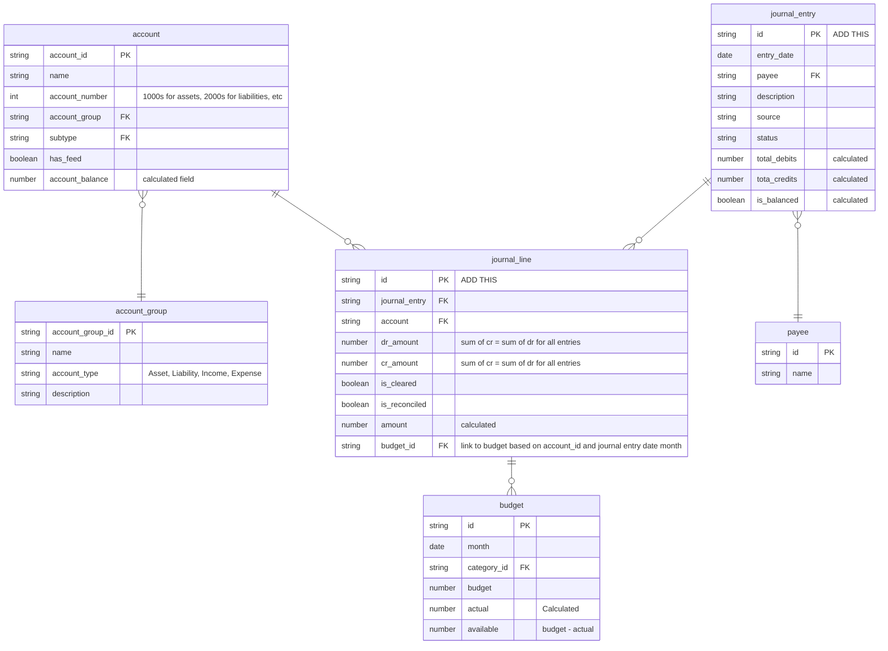

This is how you imagine a
project to be in simple text
and it can be as long or
short as you want. Good
for keeping focused at the
beginning of an effort.

# Architecture

# Model Structure

```mermaid
erDiagram
	direction TB
	payee {
		string id PK ""
		string name  ""
	}

	account_group {
		string account_group_id PK ""
		string name ""
		string account_type "Asset, Liability, Income, Expense"
		string description ""
	}


	account {
		string account_id PK ""
		string name  ""
		int account_number  "1000s for assets, 2000s for liabilities, etc"
		string account_group FK ""
		string subtype FK ""
		boolean has_feed  ""
		number account_balance  "calculated field"
	}

	journal_entry {
		string id PK "ADD THIS"
		date entry_date  ""
		string payee FK ""
		string description  ""
		string source  ""
		string status  ""
		number total_debits "calculated"
		number tota_credits "calculated"
		boolean is_balanced "calculated"
	}

	journal_line {
		string id PK "ADD THIS"
		string journal_entry FK ""
		string account FK ""
		number dr_amount  "sum of cr = sum of dr for all entries"
		number cr_amount  "sum of cr = sum of dr for all entries"
		boolean is_cleared  ""
		boolean is_reconciled  ""
		number amount "calculated"
		string budget_id FK "link to budget based on account_id and journal entry date month"
	}


	budget {
		string id PK ""
		date month ""
		string category_id FK ""
		number budget ""
		number actual "Calculated"
		number available "budget - actual"
	}


	account}o--||account_group:"  "
	account||--o{journal_line:"  "
	journal_entry||--o{journal_line:"  "
	journal_entry}o--||payee:"  "
	journal_line||--o{budget:"  "
```
