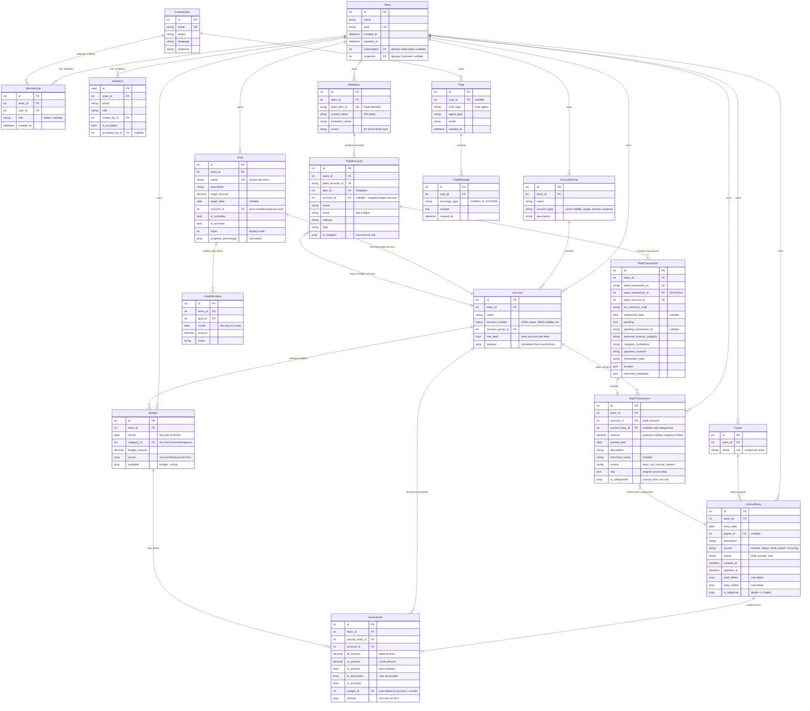

# Entity Relationship Diagram

This document contains the complete database schema for Koala Budget.

## Overview

The data model is organized around these core concepts:

1. **Multi-tenancy**: Team owns all financial data
2. **Chart of Accounts**: AccountGroup → Account hierarchy
3. **Double-Entry Ledger**: JournalEntry → JournalLine
4. **Bank Integration**: PlaidItem → PlaidAccount → BankTransaction
5. **Budgeting**: Budget (monthly) and Goal (savings targets)

## Complete ERD



## Model Relationships Summary

### Core Financial Flow

```
AccountGroup (type: asset/liability/equity/income/expense)
    └── Account (account_number determines type range)
            ├── JournalLine (debit or credit movements)
            │       └── JournalEntry (balanced entry, multiple lines)
            ├── Budget (monthly planned amount, auto-linked to JournalLine)
            ├── BankTransaction (imported, links to JournalEntry when categorized)
            └── Goal (1:1, auto-created equity account)
                    └── GoalAllocation (monthly savings contribution)
```

### Bank Feed Flow

```
PlaidItem (institution connection)
    └── PlaidAccount (individual account at institution)
            └── PlaidTransaction (extends BankTransaction with Plaid metadata)
                    └── BankTransaction (staging table)
                            └── JournalEntry (when categorized)
```

### Multi-Tenancy Scope

All models with `team_id` extend `BaseTeamModel`:
- Account, AccountGroup, Payee
- JournalEntry, JournalLine
- Budget, Goal, GoalAllocation
- BankTransaction
- PlaidItem, PlaidAccount, PlaidTransaction

## Key Constraints

| Model | Unique Constraint |
|-------|------------------|
| Account | (team, account_number) |
| AccountGroup | (team, name) |
| Payee | (team, name) |
| Budget | (team, month, category) |
| Goal | (team, name) |
| GoalAllocation | (team, goal, month) |
| Membership | (team, user) |

## Account Number Ranges

| Range | Type | Example |
|-------|------|---------|
| 1000-1999 | Asset | Checking (1000), Savings (1001) |
| 2000-2999 | Liability | Credit Card (2000) |
| 3000-3999 | Equity | Goal accounts (auto-assigned) |
| 4000-4999 | Income | Salary (4000), Freelance (4001) |
| 5000-5999 | Expense | Rent (5000), Groceries (5001) |

## Validation Rules

### JournalEntry
- `total_debits` must equal `total_credits` (balanced entry)
- Status transitions: draft → posted → void

### JournalLine
- Exactly one of `dr_amount` or `cr_amount` must be non-zero
- Neither can be negative
- `budget` is auto-calculated on save based on account and entry date

### Goal
- On create, auto-generates backing Account in 3000s range
- Account type is always "equity"
- Progress calculated from sum of GoalAllocation amounts

### BankTransaction
- `is_categorized` = `journal_entry is not null`
- Amount convention: positive = outflow, negative = inflow (Plaid standard)
