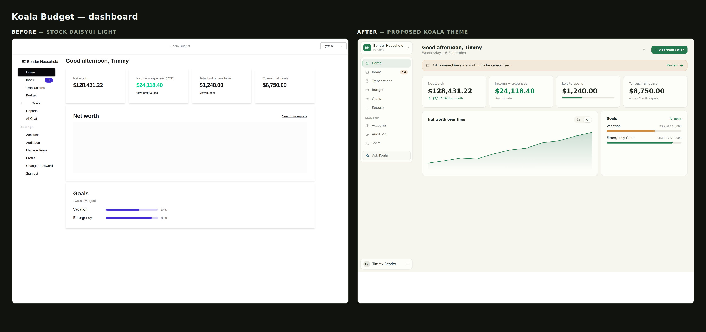
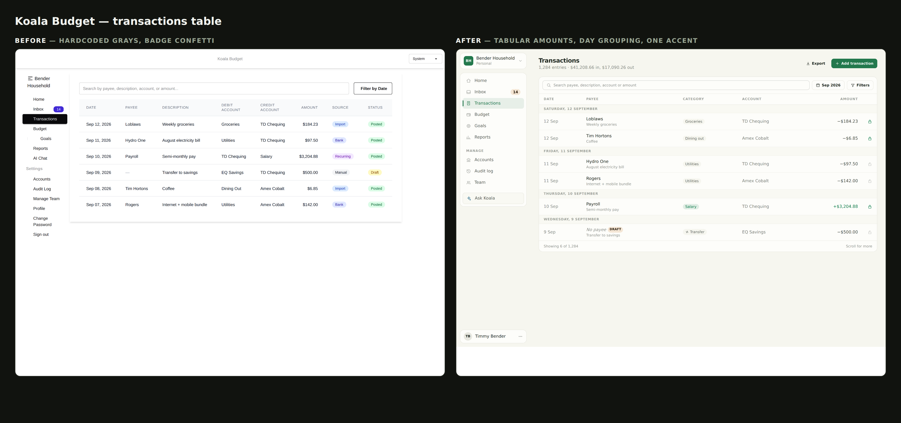
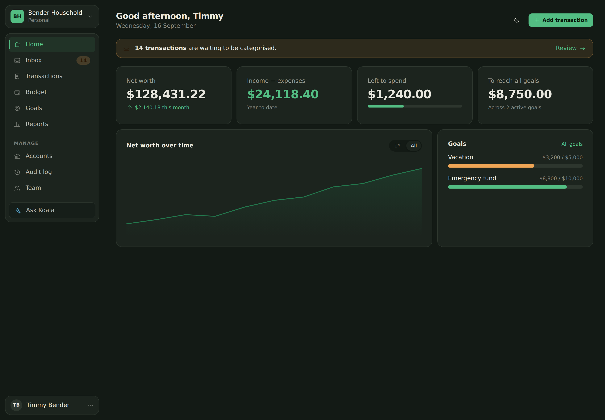
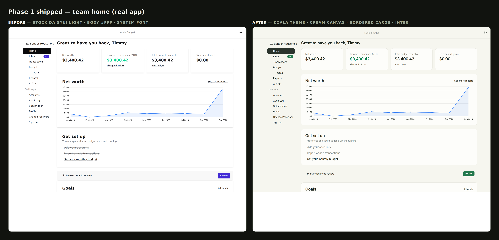
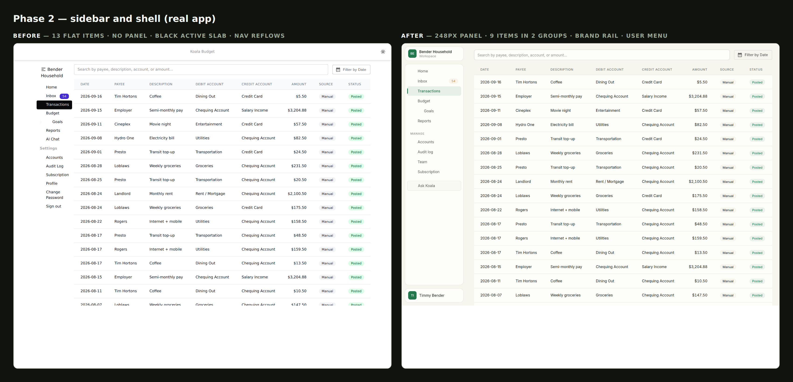

# Koala Budget — Authenticated App Restyle Plan

**Date:** 2026-09-16
**Scope:** the logged-in experience (app shell, sidebar, tables, cards). Marketing pages are out of scope.
**Supersedes the visual half of** `docs/style-audit.md` (2026-06-12). That document's Part 3 (information architecture) was
implemented; its Part 2 (visual direction) never was. This plan replaces Part 2 and explains why the direction changes.

---

## 0. Why the app looks white

`docs/style-audit.md` proposed a near-monochrome "Calm Money" direction built on restraint. The IA work shipped; the skin
did not. The result is not "restrained" — it is unstyled. Three facts compound:

| # | Fact | Location |
|---|---|---|
| 1 | DaisyUI runs on its **stock `light` / `dark`** themes. No brand color exists anywhere in the product. | `assets/styles/site-tailwind.css:16`, `koala_budget/settings.py:550-551` |
| 2 | `.app-card` declares **no background and no border** — only padding and a shadow. | `assets/styles/app/tailwind/app-components.css:10-12` |
| 3 | `<body>` is `bg-base-100`, which in the stock light theme is **pure white — the same value cards would use**. | `templates/web/base.html:55` |

So every one of the 85 `.app-card` instances is white-on-white, separated from the page by a 1px shadow. There is no
figure/ground relationship. Adding color to components will not fix this; the *canvas* has to step back from the *surface*
first.

The direction also changes: "near-monochrome, color only on amounts" was the previous goal. It is not what is wanted now.
The revised target is **warm, calm, and unmistakably branded** — a cream canvas, one green brand hue, one amber accent,
semantic green/red reserved for money. Color carries hierarchy; it is not decoration.

---

## 0.1 Before / after

Rendered from the repo's real markup and class names, compiled against the actual Tailwind 4 + DaisyUI 5 toolchain.

**Dashboard**



**Transactions**



**Dark mode** (`koala-dark`)



---

## 1. Findings

### 1.1 Shell

- **The top navbar is a 90px band containing a centered wordmark and a theme `<select>`.** Nothing else. On every
  authenticated page it costs a full row of vertical space and contributes no navigation.
  `templates/web/components/top_nav.html:1-37`
- **The sidebar has no surface of its own.** It is a bare `<ul class="menu">` on the same white as the content, so the nav
  and the page bleed into each other. `templates/web/components/app_nav.html:16-18`
- **The sidebar reflows between pages.** `<div class="w-64 hidden lg:flex">` sits in a flex row with no `shrink-0`, so a
  wide table squeezes it: "Bender Household" and "Change Password" wrap to two lines on Transactions but not on Home. The
  nav visibly changes width as you navigate. `templates/web/app/app_base.html:11`
- **The active item is a full-black pill** (stock DaisyUI `menu-active`) — a maximum-contrast slab against white, the
  harshest element on the screen.
- **The team switcher is undecorated text** next to a hamburger glyph, with no affordance that it opens anything.
  `templates/web/components/app_nav.html:2-15`
- **13 flat nav items.** `Profile`, `Change Password`, and `Sign out` occupy prime sidebar space; account-level actions are
  mixed with product navigation. `templates/web/components/app_nav_menu_items.html`

### 1.2 Tables

Measured on the Transactions table, the densest screen in the product
(`assets/javascript/transactions/TransactionsTable.jsx:114-178`):

- **Amounts are not tabular and carry no sign or color.** `$184.23` (an expense) and `$3,204.88` (salary) render
  identically — same weight, same color, digits not aligned in the column. In a double-entry budgeting app, direction of
  money is the single most important thing a row communicates, and it is currently invisible. `:169`
- **Badge confetti.** Five pastel hues across two low-value columns (Source, Status). `Posted` is ~98% of rows and still
  gets a green badge, so the eye is drawn to the least informative column on the page. `:22-31`
- **Hardcoded Tailwind grays** — 28 instances in this one file (`bg-white`, `divide-gray-200`, `text-gray-500`,
  `bg-gray-50`). These are theme-blind: the table stays light-on-light in dark mode. 64 such instances remain across the
  authenticated app.
- **Accounting jargon as column headers.** `DEBIT ACCOUNT` / `CREDIT ACCOUNT` wrap to two lines, making the header row
  taller than it needs to be, and require the reader to do the double-entry mapping themselves.
- **Rows have padding but no rhythm.** `px-6 py-4` is generous, yet the table reads as an undifferentiated block: no date
  grouping, no visual anchor, uniform hairlines between every row.

### 1.3 Three design systems

| System | Where | Volume |
|---|---|---|
| DaisyUI | server-rendered templates | 179 templates |
| Pegasus `pg-*` | a parallel vocabulary for the same components | **457 occurrences across 101 files** |
| Material UI 7 | Bank Feed + Transactions — the two screens users spend the most time in | 13 files import `@mui/*` |

Icons are likewise tripled: Font Awesome 6 (CDN, `templates/web/base.html:43-44`), inline Heroicon SVGs, and
`@mui/icons-material`.

**Bug found while auditing this:** the MUI theme is computed once with an empty dependency array, so toggling dark mode
does not recolor the Bank Feed table until a full page reload.
`assets/javascript/bank_feed/react/LineTableMaterial.jsx:145-151`

---

## 2. Direction

Four rules, in priority order:

1. **Canvas recedes, surfaces advance.** Page is `base-200` (warm paper), cards are `base-100` (warm white) with a
   `base-300` hairline border. No shadows except on true overlays. This is the single change that ends the white-out.
2. **One brand hue, one accent.** Eucalyptus green is the brand (primary): nav active state, primary buttons, the net-worth
   line. Amber is the accent: attention banners, goals, the inbox badge. Nothing else introduces a hue.
3. **Color on money is semantic, never decorative.** Green = money in. Ink = money out. Red = negative balance or
   over-budget only. Badges are removed wherever the state is the default.
4. **Density over decoration in tables.** Tighter rows, tabular numerals, day-grouping headers for rhythm, and one quiet
   status glyph instead of two colored badge columns.

### 2.1 Theme tokens

Replace `@plugin "daisyui";` in `assets/styles/site-tailwind.css:16` with the following, and set
`LIGHT_THEME = "koala"` / `DARK_THEME = "koala-dark"` in `koala_budget/settings.py:550-551`.

```css
@plugin "daisyui" {
  themes: koala --default, koala-dark --prefersdark;
}

@plugin "daisyui/theme" {
  name: "koala";
  default: true;
  color-scheme: light;

  --color-base-100: oklch(99.2% 0.004 106);   /* card / raised surface — warm white */
  --color-base-200: oklch(97%   0.008 106);   /* page canvas — warm paper */
  --color-base-300: oklch(92.5% 0.011 106);   /* hairlines, dividers */
  --color-base-content: oklch(27%  0.017 150);/* warm near-black ink */

  --color-primary: oklch(51% 0.105 157);      /* eucalyptus — brand */
  --color-primary-content: oklch(98% 0.012 157);
  --color-secondary: oklch(50% 0.085 233);    /* dusty blue — links, info series */
  --color-secondary-content: oklch(98% 0.01 233);
  --color-accent: oklch(70% 0.125 66);        /* ochre — attention, goals */
  --color-accent-content: oklch(24% 0.04 66);
  --color-neutral: oklch(31% 0.018 150);
  --color-neutral-content: oklch(97% 0.008 106);

  --color-info: oklch(50% 0.085 233);
  --color-info-content: oklch(98% 0.01 233);
  --color-success: oklch(52% 0.12 157);
  --color-success-content: oklch(98% 0.012 157);
  --color-warning: oklch(70% 0.125 66);
  --color-warning-content: oklch(24% 0.04 66);
  --color-error: oklch(54% 0.17 25);
  --color-error-content: oklch(98% 0.01 25);

  --radius-selector: 9999px;   /* badges, pills, progress */
  --radius-field: 0.5rem;      /* inputs, buttons, nav items */
  --radius-box: 0.875rem;      /* cards, panels */
  --border: 1px;
  --depth: 0;                  /* flat — borders do the separating, not shadows */
  --noise: 0;
}

@plugin "daisyui/theme" {
  name: "koala-dark";
  prefersdark: true;
  color-scheme: dark;

  --color-base-100: oklch(25%   0.016 150);
  --color-base-200: oklch(21%   0.015 150);
  --color-base-300: oklch(32%   0.018 150);
  --color-base-content: oklch(93% 0.012 106);

  --color-primary: oklch(72% 0.13 157);
  --color-primary-content: oklch(19% 0.03 157);
  --color-secondary: oklch(70% 0.10 233);
  --color-secondary-content: oklch(18% 0.03 233);
  --color-accent: oklch(78% 0.13 66);
  --color-accent-content: oklch(22% 0.04 66);
  --color-neutral: oklch(32% 0.018 150);
  --color-neutral-content: oklch(93% 0.012 106);

  --color-info: oklch(70% 0.10 233);
  --color-info-content: oklch(18% 0.03 233);
  --color-success: oklch(72% 0.13 157);
  --color-success-content: oklch(19% 0.03 157);
  --color-warning: oklch(78% 0.13 66);
  --color-warning-content: oklch(22% 0.04 66);
  --color-error: oklch(68% 0.16 25);
  --color-error-content: oklch(18% 0.03 25);

  --radius-selector: 9999px;
  --radius-field: 0.5rem;
  --radius-box: 0.875rem;
  --border: 1px;
  --depth: 0;
  --noise: 0;
}
```

Every DaisyUI surface in the app reskins from this block alone — no template edits required for the color change itself.

### 2.2 Typography

Load **Inter** (self-hosted variable, not a Google Fonts CDN call) in `templates/web/base.html`, so the app and the
`frontend/` SPA stop rendering in different typefaces. Then fix a three-step scale and delete `pg-title`/`pg-subtitle`:

| Role | Class |
|---|---|
| Metric / hero figure | `text-[1.75rem] font-semibold tracking-tight tabular-nums` |
| Page title | `text-xl font-semibold tracking-tight` |
| Section label | `text-[0.6875rem] font-semibold uppercase tracking-[0.08em] text-base-content/45` |
| Body / label | `text-sm`, muted at `text-base-content/60` |

Amounts use `font-variant-numeric: tabular-nums`, **not** `font-mono` — digits align down a column without the typewriter
texture. Apply via a `.money` utility rather than per-site classes.

### 2.3 Component primitives

Replace `.app-card` (`assets/styles/app/tailwind/app-components.css`) and add the shell/table primitives. Because
`.app-card` is already used in 85 places, redefining it reskins those for free:

```css
.app-card    { @apply bg-base-100 border border-base-300 rounded-box p-5 lg:p-6; }
.app-surface { @apply bg-base-100 border border-base-300 rounded-box; }
.money       { font-variant-numeric: tabular-nums; }

/* sidebar */
.side-link {
  @apply relative flex items-center gap-3 rounded-field px-3 py-2 text-sm text-base-content/75
         transition-colors hover:bg-base-300/45 hover:text-base-content;
}
.side-link-active {
  @apply bg-primary/10 font-medium text-primary hover:bg-primary/10 hover:text-primary;
}
.side-link-active::before {           /* 3px brand rail instead of a black slab */
  content: '';
  @apply absolute left-0 top-1/2 h-5 w-[3px] -translate-y-1/2 rounded-full bg-primary;
}

/* data table */
.data-table { @apply w-full text-sm border-separate border-spacing-0; }
.data-table thead th {
  @apply sticky top-0 z-10 bg-base-100 px-4 py-2.5 text-left align-bottom whitespace-nowrap
         text-[0.6875rem] font-semibold uppercase tracking-[0.07em] text-base-content/45
         border-b border-base-300;
}
.data-table tbody td          { @apply px-4 py-2.5 align-middle border-b border-base-300/55; }
.data-table tbody tr:hover td { @apply bg-base-200/70; }
.data-table tbody tr.row-daygroup td {
  @apply bg-base-200/60 px-4 py-1.5 text-[0.6875rem] font-semibold uppercase
         tracking-[0.07em] text-base-content/45 border-b border-base-300/55;
}
.cell-amount { @apply text-right whitespace-nowrap font-medium tabular-nums; }
.amount-in   { @apply text-success; }
.amount-out  { @apply text-base-content/85; }
```

### 2.4 Shell layout

- **Delete the top navbar on authenticated pages.** Move the theme toggle and Sign out into the sidebar user menu. Each
  page gets a header row instead: title + subtitle left, one primary action right.
- **Sidebar becomes a fixed 248px sticky column** (`shrink-0`, `sticky top-0 h-screen`) made of three stacked surfaces:
  team switcher (avatar square + name + role + chevron), nav panel, user row pinned to the bottom.
- **Nav drops to 9 items** in two groups — `Home · Inbox · Transactions · Budget · Goals · Reports`, then
  `MANAGE: Accounts · Audit log · Team`. `Profile`, `Change Password`, and `Sign out` move into the bottom user menu. AI
  Chat becomes a distinct "Ask Koala" affordance below the nav, not a list item wedged between Reports and Settings.
- **Content column caps at `max-w-[1180px]`** and centers, replacing the Bootstrap-era `container` that currently leaves a
  dead right gutter on wide screens.

### 2.5 Transactions table

| Change | Rationale |
|---|---|
| `Debit Account` + `Credit Account` → `Category` + `Account` | Removes jargon and one column; the category is what users scan for |
| Amount gets sign + semantic color + tabular numerals | Direction of money becomes readable at a glance |
| Description moves under the payee as a second line | Frees horizontal space, removes the `truncate` that hides content |
| Day-grouping header rows | Gives the ledger rhythm without `table-zebra` |
| `Source` column → dropped (available in the row detail / audit history) | Lowest-value column on the page |
| `Status` badge → shown only when **not** `Posted` | Kills four of the five badge hues |
| Reconciled state → one lock glyph, green filled vs. gray open | Matches the Bank Feed convention already shipped |
| Toolbar moves inside the table card | The search box currently floats disconnected above the data |

---

## 3. Phased plan

Ordered by visible-impact-per-unit-of-risk. Each phase ships independently.

### Phase 1 — Theme + primitives ✅ *shipped*



- `assets/styles/theme.css` **(new)** — the `koala` / `koala-dark` theme blocks (§2.1), registering daisyUI once
- `assets/styles/site-tailwind.css` — imports the theme instead of `@plugin "daisyui"`
- `assets/styles/fonts.css` **(new)** + `vite.config.ts` — self-hosted Inter as its own stylesheet entry
- `frontend/src/index.css` — the SPA imports the same theme and font, so auth and app finally match
- `koala_budget/settings.py:550-551` — `LIGHT_THEME = "koala"`, `DARK_THEME = "koala-dark"`
- `tailwind.config.js` — `darkMode` selector follows the renamed dark theme
- `assets/styles/app/tailwind/app-components.css` — `.app-card` gains a surface and border; adds `.app-surface`,
  `.money`; `.help` drops its hardcoded gray
- `templates/web/base.html` — `body_class` block + legacy theme-name migration in `syncDarkMode`
- `templates/web/app/app_base.html` — app pages opt into `bg-base-200`
- `assets/javascript/bank_feed/react/LineTableMaterial.jsx` — the dark-mode `useMemo` bug from §1.3

Reskinned all 179 templates and all 85 `.app-card` sites without editing any of them.

**Two things worth knowing before Phase 2:**

1. **Import order is load-bearing, and failures are silent.** Every `@import` must sit at the top of
   `site-tailwind.css`, before any other rule — CSS drops an `@import` that follows a regular at-rule (such as
   `@theme { … }`) with no build error, taking the whole imported file with it. The theme import must also precede the
   component imports, because those `@apply` theme colors that do not exist until daisyUI is registered.
2. **Font CSS cannot live in the Tailwind entry.** Tailwind inlines `@import`s before Vite's CSS pipeline runs, so the
   `src: url(./files/…)` paths inside `@fontsource-variable/inter` are never rebased; they resolve against `/static/css/`
   and 404, and the font silently falls back to system UI. Hence `assets/styles/fonts.css` as a separate entry.

**The predicted risk did not materialise as expected.** The 64 hardcoded-gray sites read acceptably against the warm
canvas in light mode. In *dark* mode the Transactions table is a white slab — but it renders identically on the
pre-Phase-1 baseline, so this is pre-existing breakage that Phase 3 fixes, not a regression.

### Phase 2 — Shell and sidebar ✅ *shipped*



- `templates/web/app/app_base.html` — sticky `w-[248px] shrink-0` sidebar, `min-w-0` content column capped at
  `max-w-[1180px]`; the top navbar now renders only below `lg`
- `templates/web/components/app_nav.html` — team switcher, nav panel, and a user menu holding Profile / Change
  Password / theme / Sign out
- `templates/web/components/app_nav_menu_items.html` — 13 flat items → 9 in two groups (`Manage`), as plain anchors so
  the desktop sidebar and the mobile dropdown share one source
- `templates/web/components/top_nav_app.html` — rebuilt around the shared anchors; repeats the account actions, since
  the sidebar's user menu is hidden on mobile
- `assets/styles/app/tailwind/app-components.css` — `.side-link`, `.side-link-active`, `.side-section`, `.side-tile`,
  `.side-avatar`
- `templates/web/components/team_nav.html` — **deleted**; its one Subscription link moved into the Manage group
- **Fixed:** the sidebar-reflow bug — verified stable at 248px across Home, Transactions and Budget

**`page_header.html` was not created.** Pages already carry their own titles, and removing the navbar did not leave a
gap, so the include would have been dead code. It belongs with whichever phase first restyles page headers.

**Django's `{# … #}` comment is single-line only.** A multi-line one renders as literal text on the page — it does not
error. The first cut of this phase shipped four of them and the comment bodies appeared in the UI. Use
`…` for anything spanning lines.

**Pre-existing, not introduced here:** the budget page overflows its viewport by 22px at 420px wide. Measured
identically before and after this phase.

### Phase 3 — Tables and color violations

- `assets/javascript/transactions/TransactionsTable.jsx` — full rewrite per §2.5; removes all 28 gray instances
- `templates/budget/components/budget_table.html` — `.data-table`, `currency` filter on the last raw `text-gray-500`
- Remaining 36 hardcoded-gray instances across authenticated templates → `text-base-content/{60,70}`
- Drop `table-zebra` (7 sites) in favor of hairlines + hover

### Phase 4 — Retire Pegasus

457 occurrences across 101 files, but mechanically substitutable — `pg-button-primary` → `btn btn-primary`,
`pg-title`/`pg-subtitle` → the §2.2 scale, `pg-card` → `.app-card`. Delete
`assets/styles/pegasus/tailwind.css`, `templates/pegasus/`, `templates/teams_example/`. Scriptable with review, one class
at a time, highest-count first.

### Phase 5 — Migrate Bank Feed + Transactions off MUI

Largest item, do last, one screen at a time. Removes `@mui/material`, `@mui/icons-material`, and `@material-table/core`
from the bundle and makes the two most-used screens match the rest of the product. TanStack Table (headless) is the
natural replacement — pagination is already server-side. **Fix the dark-mode `useMemo` bug (§1.3) in Phase 1 as a
one-liner** rather than waiting for this phase.

### Phase 6 — One icon set

Consolidate on inline SVG (Lucide-style, ~24 icons), drop the Font Awesome CDN from `templates/web/base.html:43-44` and
`@mui/icons-material` with Phase 5. Removes a third-party render-blocking request and a privacy hop.

---

## 4. Verification

- E2E `data-testid` attributes are preserved throughout — no phase should touch a selector. Run `make test-e2e` after
  Phases 2, 3, and 5.
- Check every phase in **both** themes. Today's hardcoded grays mean dark mode is already broken on several screens;
  the restyle should not ship new instances.
- Contrast: all token pairs above target WCAG AA for body text. Re-verify `--color-accent` on `--color-base-100` if the
  accent is ever used for small text rather than as a surface tint.

---

## 5. Open decisions

1. **Green as brand.** Eucalyptus reads "koala" and "money," but green also carries "positive amount" in the tables. The
   proposal separates them by weight and context (brand green is used on chrome, semantic green only on figures). If that
   feels muddy, the alternative is a deep teal or indigo brand with green reserved entirely for money.
2. **Dark-mode depth.** `koala-dark` currently sits quite dark (`base-200` at 21% L). Lightening the whole ramp ~4% is a
   one-line change if it feels heavy in review.
3. **Top navbar removal** assumes nothing else needs to live there. Confirm before Phase 2 — it currently holds only the
   wordmark and theme selector.
4. **Phase 4 vs. Phase 5 ordering.** Pegasus removal is larger in file count but far lower in risk than the MUI
   migration. They can run in parallel if two people are working.
